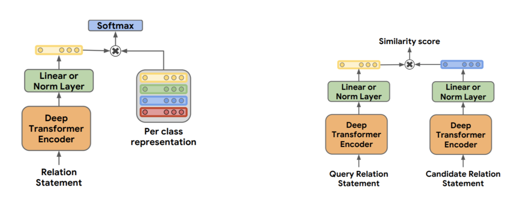

## [Matching the Blanks: Distributional Similarity for Relation Learning](https://arxiv.org/pdf/1906.03158.pdf)

- 目标：基于大量未标注语料，训练一个relation表征的模型
- input：relation statement(x, s1, s2)
- output：relation representation: 一个稠密向量，使得两个关系越接近，两个关系的表征向量点积值越大
- bert-based architecture:
- 预训练
    - There is high degree for redundancy in web text, relation between tow entity is likely to be stated multiple times
    - 两个不同的句子中，如果包含相同的实体对，这个实体对在两句话中大概率表示相同的relation
    - 两个不同的句子中，如果包含不同实体对，这两个实体对大概率表示不同的relation
    - 例子:
    - 结构:
- 实验细节
    - 采用维基百科数据，用google cloud natural language api做实体链接
    - 以α = 0.7的概率将entity mention 替换成[BLANK]
    - negative sampling with relations share one entity
    - 生成了600M的实体对,正负样本1:1
- 实验结果
    - 在supervised training任务下，有细微提高，可以提高模型收敛速度
    - 在Few Shot任务下，提高明显:
- 启发
    - 想办法在未标注数据中提取有用信息，在大规模数据上做预训练，然后在标注任务中做fine-tune是提升任务效果的比较好的方案（BERT,GPT...）。这种方案相比在给定的标注数据下，优化模型的结构，往往提升更多
    - 我们爬取了百度百科的数据，可以利用百科网页的链接+简单的实体链接技术，在百度百科的数据上预训练一个中文关系表征模型
    - 可以基于关系表征模型做聚类，用来发现新的关系，进而做一个schema-free的抽取系统